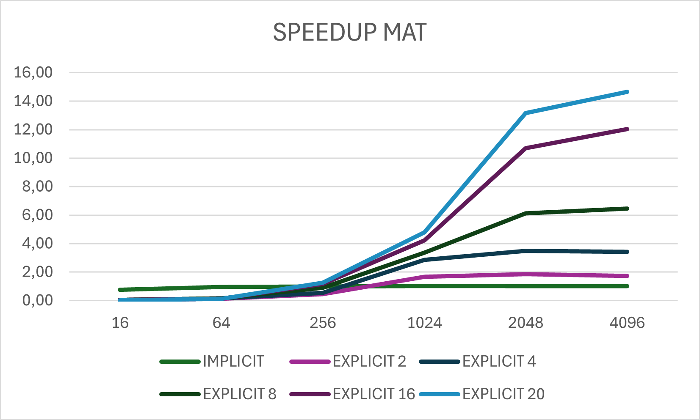
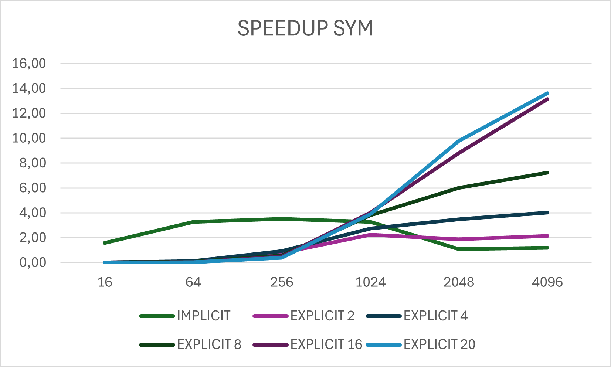
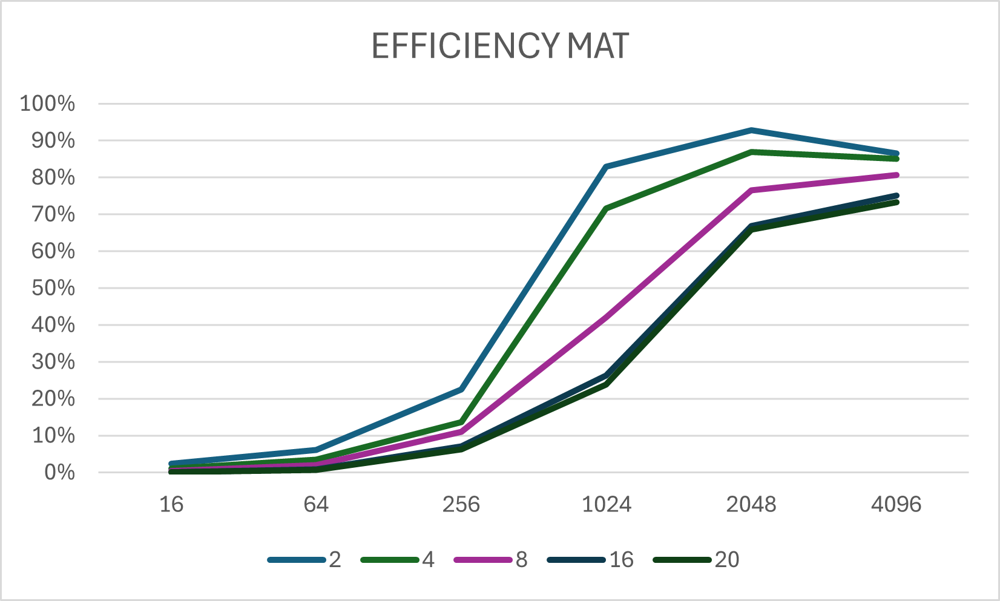
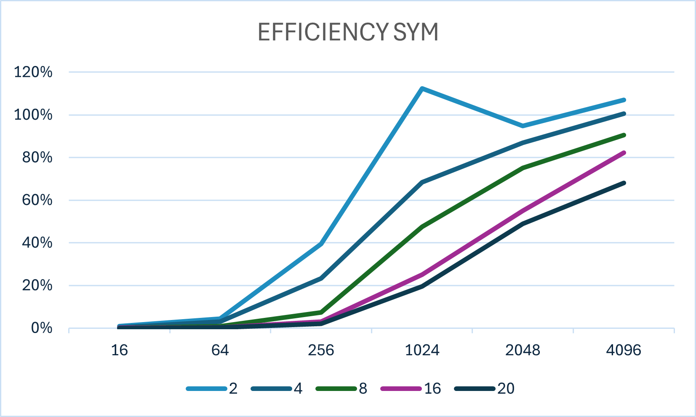

# IntroPARCO-2024-H1
Homework for the first deliverable of the course "Introduction to parallel computing" in University of Trento.

In this repository we will analyze the behavior of a code execution with different parallelization techniques, in particular we will consider these performance metrics: speedup and efficiency. The techniques that we will discuss are: serial execution, implicit parallelism execution (with optimization flags and pragmas) and explicit parallelism execution (using OpenMP directives).
The task that we want to implement is a code for a matrix transposition with different matrix sizes and different parallelization methods to compare the wall-clock time of each approach and find the best solution to optimize the performance and the resource usage.  

# Index
1. [System Description](#system-description)
2. [Set up the Project](#set-up-the-project)
3. [Record the Wall-Clock Time](#record-the-wall-clock-time)
4. [Implicit Parallelism Implementation](#implicit-parallelism-implementation)
5. [Explicit Parallelism Implementation](#explicit-parallelism-implementation)
6. [Compilation and Execution](#compilation-and-execution)
7. [Performance Analisys](#performance-analisys)

## System Description
We are working on the university cluster that has these characteristics:
- composed of 142 CPU calculation nodes running at 2.3GHz for a total of 7674 cores and 10 GPU calculation nodes for a total of 48.128 CUDA cores
- operating system: Linux CentOS 7
- cluster management software: PBS Professional
- compiler: GCC 9.1.0.
- RAM: 65 TB
- nodes are interconnected with 10Gb/s network and some have Infiniband connectivity, others have Omni-Path connectivity

## Set up the Project
The first thing to do is accessing the cluster (if necessary) with the `ssh` command. Then we have to start an interactive session with the following line:
```
qsub -I -q name_queue 
```
we can also include some specifications on which characteristics the queue we are entering must have:
```
qsub -I -q name_queue -l select=1:ncpus=60:ompthreads=60:mem=1mb
//number of nodes, number of CPU/core, number of threads and memory per node 
```
After we start an interactive session we must enter the folder in which we want to work and create the file for our project, could be done with this command: `touch homework.c`
And then we can start writing our sequential code that must contain:
- control on the [size of the matrix](https://github.com/sophiee03/IntroPARCO-2024-H1/blob/f0f57507d67a5b9177c49b7338466a276ca22a54/code.c#L22)
- control on the [matrix allocation](https://github.com/sophiee03/IntroPARCO-2024-H1/blob/f0f57507d67a5b9177c49b7338466a276ca22a54/code.c#L198)
- control of [symmetry](https://github.com/sophiee03/IntroPARCO-2024-H1/blob/04e2b838caaa45dd578e82cc1c8653a569859f2b/code.c#L56) (if true the transposition is not needed)
- function to [transpose the matrix](https://github.com/sophiee03/IntroPARCO-2024-H1/blob/f0f57507d67a5b9177c49b7338466a276ca22a54/code.c#L124)
- function to control if the implicit/explicit transposition is [executed correctly](https://github.com/sophiee03/IntroPARCO-2024-H1/blob/04e2b838caaa45dd578e82cc1c8653a569859f2b/code.c#L39)

After we implemented these functions we will have the base code with which we can then compare the parallel one.

## Record The Wall-Clock Time
To obtain the time taken for the execution we have to use the `gettimeofday()` function of the `sys/time.h` library, implemented in this way:
```
struct timeval start_tv, end_tv;
struct timespec start_ts, end_ts;
gettimeofday(&start_tv, NULL);
  //code to measure
gettimeofday(&end_tv, NULL);
long seconds_tv = end_tv.tv_sec - start_tv.tv_sec;
long microseconds_tv = end_tv.tv_usec - start_tv.tv_usec;
double elapsed_gettimeofday = seconds_tv + microseconds_tv*1e-6;
printf("    wall-clock time for the symmetric check: %.8f milliseconds\n", elapsed_gettimeofday*1000);
```
***N.B.*** For the OpenMP timings we have another tool to record the time taken: we store the start and end times in two variables with the `omp_get_wtime()` function included in the `omp.h` library and then compute the difference to find the wall-clock time.

***N.B.*** In this report all the timings are taken in milliseconds 

## Implicit Parallelism Implementation
The first parallelization approach is the implicit parallelism one: it consists in adding some optimization flags in the compilation and the most suitable pragmas above the code that we want to optimize. In our case, we have two nested loops to create the [transposed-matrix](https://github.com/sophiee03/IntroPARCO-2024-H1/blob/f0f57507d67a5b9177c49b7338466a276ca22a54/code.c#L141), these pragmas are the most suitable one for our code: 
- the `#pragma simd` directive tells the compiler to force the vectorization
- the `#pragma unroll(n)` directive will unroll the loops on a certain degree (n).

For what concern the optimization flags, after a few trials with different ones we can conclude that the most performant combination of flags for our code is `-O2 -funroll-loops`. If we want to take the code all together in one file and make the flags affect only the implicit parallelism part, we must add above the function: `#pragma GCC optimize ("O2", "unroll-loops")`.

***N.B.*** The same optimizations could be applied to the [symmetric-check](https://github.com/sophiee03/IntroPARCO-2024-H1/blob/f0f57507d67a5b9177c49b7338466a276ca22a54/code.c#L77)

## Explicit Parallelism Implementation
The other method that we have to observe is the explicit parallelism one. First we have to include the `<omp.h>` library. The openMP method for the [matrix-transposition](https://github.com/sophiee03/IntroPARCO-2024-H1/blob/f0f57507d67a5b9177c49b7338466a276ca22a54/code.c#L160) will execute with a certain number of threads the parallel regions (the ones contained in `#pragma omp parallel{...}`) and use even more optimizations added by clauses, for example, in our case we can insert a `for collapse(2)` directive above the for loops to compress them in a single amount of iterations divided among the threads. Another clause that we can attach is the `schedule(auto)` clause that will tell the compiler that at runtime it must choose the best scheduling strategy based on the system characteristics.

***N.B.*** Also in this case, the same optimizations could be applied for the [symmetric-check](https://github.com/sophiee03/IntroPARCO-2024-H1/blob/f0f57507d67a5b9177c49b7338466a276ca22a54/code.c#L102)

## Compilation and Execution
Once we have our code with the three different approaches we can compile and execute it to record the timings and observe the improvements. 
To compile the code:
```
gcc -o result homework.c -fopenmp
```
***N.B.*** it is necessary to include in the compilation the `-fopenmp` flag to tell the compiler to use the OpenMP functionality (otherwise the explicit paralellism code will not be executed in paralell with threads)

To run our compiled code we have two possibilities: 
- the first method is to use the interactive session that we have started and execute many times with different number of threads and matrix sizes. This is done with the `export OMP_NUM_THREADS=2; ./result 64` command
- the second and faster method is to create a [.pbs script](script.pbs) in which we tell the compiler the number N of executions that we want. This is done by using Job Arrays: the code in the PBS script will be executed N times in the same environment with the parameters that we have included in the code (matrix size and number of threads). If we want to change parameters and test with different ones we need only to change these values. To submit this job we must write the following command: `qsub ./script.pbs` and then in our folder we will find the N output files generated.

## Performance Analisys
After we recorded a sufficient number of executions we can make the averages for each method and compare the results by calculating the speedup, that is how much the code is faster with respect to the serial one, and efficiency, that measure how efficiently the resources (threads) are utilized.

To calculate the speedup:
```Speedup = SerialTime / ParallelTime```

To calculate the efficiency:
```Efficiency = Speedup / N_Threads```

We can observe the trend of these metrics in the following graphs:
<div style="display: flex; justify-content: space-around;">
  
  
</div>
<div style="display: flex; justify-content: space-around;">
  
  
</div>
